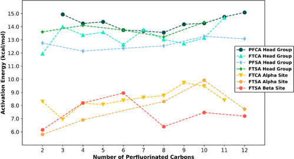

# Project Template
This Repo is meant to be used when starting a project in the Vyas Research Group. As a collective group we discussed that it would be nice to have some sort of standard for level of documentation for our projects. If one of us where to pass on a poject everything for anther person to take over should be available for in a repository. This level of organization and documentation should also aid with writing at the end of a project as well as intragroup collaboration.

This outermost README should be the "Eagles' eye view of the project". This is something you could send to Dr. Vyas or peer as an update for where the project is at and how you are performing your research. 

Below is a template for what a README might look like with markdown headers and an accompanying paragraph describing what the section is for.

# Current Research Goal

It is common for research questions and hypothesis tend to change and adapt as a project progresses. This section should be updated as the hypothesis or questions change or accumulate. If a question is answered an answer should be placed immediately after the question so that it is easily found for future readers. The addition of figures to help explain questions and results is encouraged and you can link to them in the figures directory as shown below. This also lets figures be updated dynamically as you collect data and add to the figure of the same name

e.g.

Question 1: Which proton in a fluorotelomer alchohol is most readily abstracted by a hydroxyl radical in gas phase?
*Hydrogens on the fluorinated chain have a lower barier for abstraction than protons on the alcohol head group.*

Question 2: Does ozone lead to interactions with fluorotelomer alcohols in the atmosphere

# Methods and Worflows

This section should essentially be the methods section of your paper. It should contain information such as what software you are using, level of theory you are using, as well as some information on how they are run on wendian or on your computer. 

Outside of the typical methods descriptions you should also include naming conventions for files so other people cna easily park outputs and inputs. If you are generating files or reading files programmatically this may provide a quick expanation of what that script (hopefully somewhere in the project repo) does.

# Common Trouble Shooting

Often working with a new software or in a niche application of a software you may run in to some issues that have a simple fix you wish you had someone explain to you. This is the section to put those for future users if they take over your project or wish to colaborate.